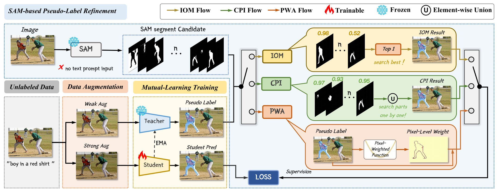

# SAM as the Guide: Mastering Pseudo-Label Refinement in Semi-Supervised Referring Expression Segmentation
Welcome you to the official repository for our method presented in
"SAM as the Guide: Mastering Pseudo-Label Refinement in Semi-Supervised
Referring Expression Segmentation."


## Setting Up
### Package Dependencies
1. Create a new Conda environment with Python 3.7 then activate it:
```shell
conda create -n SemiRES python==3.7
conda activate SemiRES
```

2. Install PyTorch:
```shell
pip install torch==1.10.0+cu111 torchvision==0.11.0+cu111 torchaudio==0.10.0 -f https://download.pytorch.org/whl/torch_stable.html
```

3. Install the packages in `requirements.txt` via `pip`:
```shell
pip install -r requirements.txt
```
4. cd segment-anything && pip install -e . && cd ..

### Datasets
1. Follow instructions in the `./refer` directory to set up subdirectories
and download annotations.
This directory is a git clone (minus two data files that we do not need)
from the [refer](https://github.com/lichengunc/refer) public API.

2. Download images from [COCO](https://cocodataset.org/#download).
Please use the first downloading link *2014 Train images [83K/13GB]*, and extract
the downloaded `train_2014.zip` file to `./refer/data/images/mscoco/images`.

3. Prepare the annotations. For example, to generate the annotations for RefCOCO,  you can run the code:

```
python data_process.py --data_root ./refer/data --output_dir . --dataset refcoco --split unc --generate_mask
```
4. run split_dataset_select.py to generate the annotations of 1% RefCOCO semi-supervised setting.

```
python split_dataset_select.py --dataset refcoco --save-dir ./anns/refcoco/ --pick-percent 0.01
```

At this point the directory  SemiRES should look like:
```
   SemiRES
   |-- anns
       |-- refcoco
            |--masks
            |--refcoco_1%_image.json
            |--refcoco_99%_image.json
       |-- refcoco.json

```
### Generate SAM mask proposal
put SAM pretrained model https://dl.fbaipublicfiles.com/segment_anything/sam_vit_h_4b8939.pth into ./segment-anything
```
CUDA_VISIBLE_DEVICES=0,1,2,3 python -m torch.distributed.launch --nproc_per_node 4 --master_port 51240 segment-anything/sam-refcoco/segment_anything_mode.py --dataset refcoco --annotation_path ./anns/refcoco.json
```
### The Initialization Weights for Training
1. Create the `./pretrained_weights` directory where we will be storing the weights.
```shell
mkdir ./pretrained_weights
```
2. Download [pre-trained classification weights of
the Swin Transformer](https://github.com/SwinTransformer/storage/releases/download/v1.0.0/swin_base_patch4_window12_384_22k.pth),
and put the `pth` file in `./pretrained_weights`.
These weights are needed for training to initialize the model.

## Training
1. Train supervised learning Baseline
```
CUDA_VISIBLE_DEVICES=0,1,2,3 python -m torch.distributed.launch --nproc_per_node 4 --master_port 54321 train.py --model lavt --dataset refcoco --model_id refcoco --output-dir ./output/1%/refcoco/sup --batch-size 2 --lr 0.00005 --wd 1e-2 --swin_type base --pretrained_swin_weights ./pretrained_weights/swin_base_patch4_window12_384_22k.pth --epochs 40 --img_size 480 --sup_percent 1
```
2. Train SemiRES 
```
CUDA_VISIBLE_DEVICES=0,1,2,3 python -m torch.distributed.launch --nproc_per_node 4 --master_port 14278 train_semi_CPI.py --model lavt --dataset refcoco --model_id refcoco --sup_percent 1 --unsup_percent 99 --output-dir ./output/1%/refcoco/cpi --batch-size 3 --lr 0.00005 --wd 1e-2 --swin_type base --pretrained_swin_weights pretrained_weights/swin_base_patch4_window12_384_22k.pth --epochs 40 --img_size 480 --burn_int_ckpt ./output/1%/refcoco/sup/model_best_refcoco.pth
```
Note that train_semi_CPI is not the code for results of Table 1 
## Testing

Test results on RefCOCO 
```
python test.py --model lavt --swin_type base --dataset refcoco --split val --resume ./output/1%/refcoco/model_best_refcoco.pth --workers 2 --ddp_trained_weights --window12 --img_size 480 --batch-size 1
```